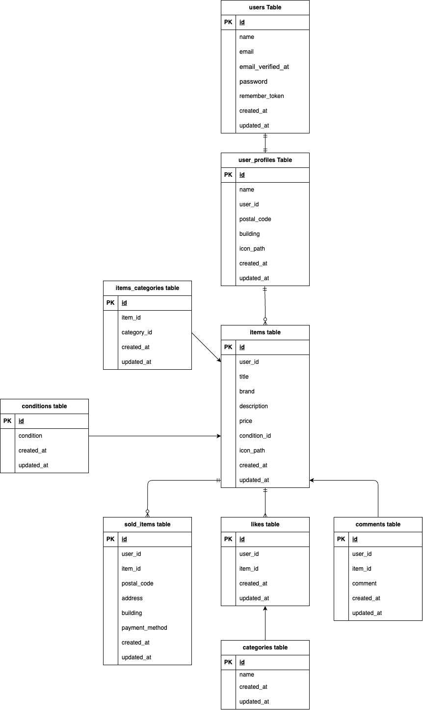

# COACHTECH フリマアプリ

## 環境構築

Dockerを使用して開発環境を構築します。

**Dockerビルド**
* git clone https://github.com/ayanedayo/coachtech_fleamarket.git
* docker-compose up -d --build

**Laravel環境構築**
* docker-compose exec php bash
* composer install
* cp .env.example .env
* php artisan key:generate
* php artisan migrate
* php artisan db:seed

## 使用技術（実行環境）
* PHP 8.x
* MySQL 8.0
* Docker / Docker Compose

## ER図
*

## URL
* 開発環境：http://localhost/
* ユーザー登録：http://localhost/register
